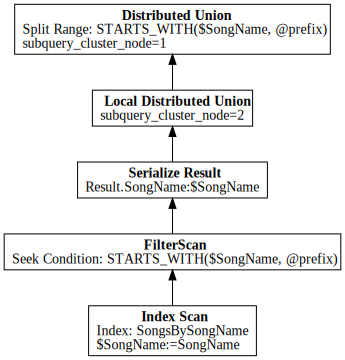

# spannerplanviz

Cloud Spanner Query Plan Visualizer using GraphViz.



## install

```
$ go get -u github.com/apstndb/spannerplanviz
```

## usage

It can read [`ResultSet`](https://cloud.google.com/spanner/docs/reference/rest/v1/ResultSet?hl=en) in JSON or YAML.

### PROFILE

```
$ gcloud spanner databases execute-sql --instance=sampleinstance sampledb --query-mode=PROFILE --format=yaml \
  --sql "SELECT SongName FROM Songs" |
  spannerplanviz --full --type=svg --output profile.svg
```
### PLAN
```
$ gcloud spanner databases execute-sql --instance=sampleinstance sampledb --query-mode=PLAN --format=yaml \
  --sql="SELECT SongName FROM Songs WHERE STARTS_WITH(SongName, @prefix)" |
  spannerplanviz --full --type=svg --output plan.svg
```