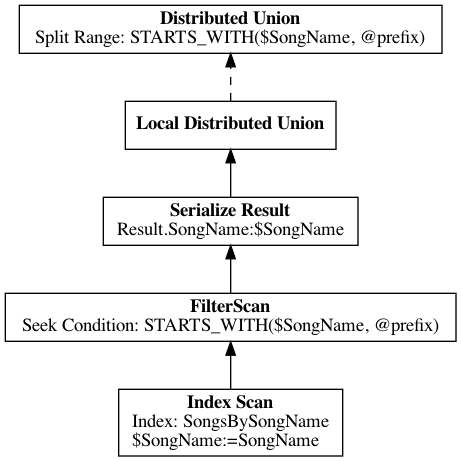
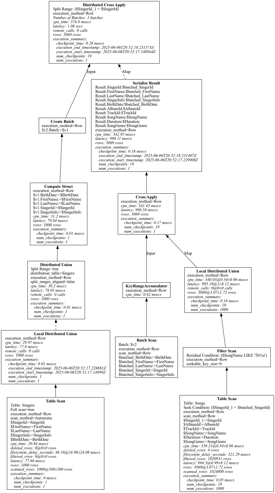

# spannerplanviz

Cloud Spanner Query Plan Visualizer using [goccy/go-graphviz](https://github.com/goccy/go-graphviz).



(Possibly) remote calls are rendered as dashed lines.

## Install

```sh
go install github.com/apstndb/spannerplanviz@latest
```

## Usage

It can read various types in JSON and YAML.

* [QueryPlan](https://cloud.google.com/spanner/docs/reference/rest/v1/ResultSetStats?hl=en#QueryPlan)
    * Can get easily by client libraries
        * [AnalyzeQuery()](https://pkg.go.dev/cloud.google.com/go/spanner#ReadOnlyTransaction.AnalyzeQuery)
        * [RowIterator.QueryPlan](https://pkg.go.dev/cloud.google.com/go/spanner#RowIterator)
* [ResultSetStats](https://cloud.google.com/spanner/docs/reference/rest/v1/ResultSetStats?hl=en)
    * Output of DOWNLOAD JSON in [the official query plan visualizer](https://cloud.google.com/spanner/docs/tune-query-with-visualizer?hl=en)
* [ResultSet](https://cloud.google.com/spanner/docs/reference/rest/v1/ResultSet?hl=en)
    * Output of `gcloud spanner databases execute-sql` and [execspansql](https://github.com/apstndb/execspansql)

### PLAN

```
$ gcloud spanner databases execute-sql --instance=sampleinstance sampledb --query-mode=PLAN --format=yaml \
  --sql="SELECT SongName FROM Songs WHERE STARTS_WITH(SongName, @prefix)" |
  spannerplanviz --full --type=svg --output plan.svg
```

### PROFILE

You see verbose profile information. (Currently, `histogram` is not shown.)

```
$ gcloud spanner databases execute-sql --instance=sampleinstance sampledb --query-mode=PROFILE --format=yaml \
  --sql "SELECT * FROM Singers JOIN Songs USING(SingerId) WHERE SongName LIKE 'Th%e'" |
  spannerplanviz --full --type=svg --output profile.svg
```



You can emit Mermaid.js using `--type mermaid` (EXPERIMENTAL).

```
spannerplanviz --full --type=mermaid --output profile.mermaid < dca_profile.json
```

<!-- visualize/testdata/dca_profile.golden.mermaid -->

```mermaid
%%{ init: {"theme": "neutral",
           "themeVariables": { "wrap": "false" },
           "flowchart": { "curve": "linear",
                          "markdownAutoWrap":"false",
                          "wrappingWidth": "2000" }
           }
}%%
graph TD
    node0["<b>Distributed&nbsp;Cross&nbsp;Apply</b>
Split&nbsp;Range\:&nbsp;\(\$SingerId\_1&nbsp;\=&nbsp;\$SingerId\)
execution\_method: Row
<i>Number&nbsp;of&nbsp;Batches: 1&nbsp;batches</i>
<i>cpu\_time: 376\.8&nbsp;msecs</i>
<i>latency: 1\.08&nbsp;secs</i>
<i>remote\_calls: 0&nbsp;calls</i>
<i>rows: 3069&nbsp;rows</i>
<i>execution\_summary\:
&nbsp;&nbsp;&nbsp;checkpoint\_time\:&nbsp;0\.28&nbsp;msecs
&nbsp;&nbsp;&nbsp;execution\_end\_timestamp\:&nbsp;2025\-06\-06T20\:52\:18\.231573Z
&nbsp;&nbsp;&nbsp;execution\_start\_timestamp\:&nbsp;2025\-06\-06T20\:52\:17\.148944Z
&nbsp;&nbsp;&nbsp;num\_checkpoints\:&nbsp;19
&nbsp;&nbsp;&nbsp;num\_executions\:&nbsp;1</i>"]
style node0 text-align:left;
node1["<b>Create&nbsp;Batch</b>
execution\_method: Row
\$v2\.Batch\:\=\$v1"]
style node1 text-align:left;
node2["<b>Compute&nbsp;Struct</b>
execution\_method: Row
\$v1\.BirthDate\:\=\$BirthDate
\$v1\.FirstName\:\=\$FirstName
\$v1\.LastName\:\=\$LastName
\$v1\.SingerId\:\=\$SingerId
\$v1\.SingerInfo\:\=\$SingerInfo
<i>cpu\_time: 31\.2&nbsp;msecs</i>
<i>latency: 79\.04&nbsp;msecs</i>
<i>rows: 1000&nbsp;rows</i>
<i>execution\_summary\:
&nbsp;&nbsp;&nbsp;checkpoint\_time\:&nbsp;0\.01&nbsp;msecs
&nbsp;&nbsp;&nbsp;num\_checkpoints\:&nbsp;1
&nbsp;&nbsp;&nbsp;num\_executions\:&nbsp;1</i>"]
style node2 text-align:left;
node3["<b>Distributed&nbsp;Union</b>
Split&nbsp;Range\:&nbsp;true
distribution\_table: Singers
execution\_method: Row
split\_ranges\_aligned: false
<i>cpu\_time: 30\.2&nbsp;msecs</i>
<i>latency: 78\.03&nbsp;msecs</i>
<i>remote\_calls: 0&nbsp;calls</i>
<i>rows: 1000&nbsp;rows</i>
<i>execution\_summary\:
&nbsp;&nbsp;&nbsp;checkpoint\_time\:&nbsp;0\.01&nbsp;msecs
&nbsp;&nbsp;&nbsp;num\_checkpoints\:&nbsp;1
&nbsp;&nbsp;&nbsp;num\_executions\:&nbsp;1</i>"]
style node3 text-align:left;
node4["<b>Local&nbsp;Distributed&nbsp;Union</b>
execution\_method: Row
<i>cpu\_time: 29\.97&nbsp;msecs</i>
<i>latency: 77\.8&nbsp;msecs</i>
<i>remote\_calls: 0&nbsp;calls</i>
<i>rows: 1000&nbsp;rows</i>
<i>execution\_summary\:
&nbsp;&nbsp;&nbsp;checkpoint\_time\:&nbsp;0\.01&nbsp;msecs
&nbsp;&nbsp;&nbsp;execution\_end\_timestamp\:&nbsp;2025\-06\-06T20\:52\:17\.228881Z
&nbsp;&nbsp;&nbsp;execution\_start\_timestamp\:&nbsp;2025\-06\-06T20\:52\:17\.14899Z
&nbsp;&nbsp;&nbsp;num\_checkpoints\:&nbsp;1
&nbsp;&nbsp;&nbsp;num\_executions\:&nbsp;1</i>"]
style node4 text-align:left;
node5["<b>Table&nbsp;Scan</b>
Table\:&nbsp;Singers
Full&nbsp;scan: true
execution\_method: Row
scan\_method: Automatic
\$SingerId\:\=SingerId
\$FirstName\:\=FirstName
\$LastName\:\=LastName
\$SingerInfo\:\=SingerInfo
\$BirthDate\:\=BirthDate
<i>cpu\_time: 29\.84&nbsp;msecs</i>
<i>deleted\_rows: 0\@0±0&nbsp;rows</i>
<i>filesystem\_delay\_seconds: 48\.16\@24\.08±24\.08&nbsp;msecs</i>
<i>filtered\_rows: 0\@0±0&nbsp;rows</i>
<i>latency: 77\.66&nbsp;msecs</i>
<i>rows: 1000&nbsp;rows</i>
<i>scanned\_rows: 1000\@500±500&nbsp;rows</i>
<i>execution\_summary\:
&nbsp;&nbsp;&nbsp;checkpoint\_time\:&nbsp;0&nbsp;msecs
&nbsp;&nbsp;&nbsp;num\_checkpoints\:&nbsp;1
&nbsp;&nbsp;&nbsp;num\_executions\:&nbsp;1</i>"]
style node5 text-align:left;
node18["<b>Serialize&nbsp;Result</b>
Result\.SingerId\:\$batched\_SingerId
Result\.FirstName\:\$batched\_FirstName
Result\.LastName\:\$batched\_LastName
Result\.SingerInfo\:\$batched\_SingerInfo
Result\.BirthDate\:\$batched\_BirthDate
Result\.AlbumId\:\$AlbumId
Result\.TrackId\:\$TrackId
Result\.SongName\:\$SongName
Result\.Duration\:\$Duration
Result\.SongGenre\:\$SongGenre
execution\_method: Row
<i>cpu\_time: 342\.95&nbsp;msecs</i>
<i>latency: 998\.11&nbsp;msecs</i>
<i>rows: 3069&nbsp;rows</i>
<i>execution\_summary\:
&nbsp;&nbsp;&nbsp;checkpoint\_time\:&nbsp;0\.18&nbsp;msecs
&nbsp;&nbsp;&nbsp;execution\_end\_timestamp\:&nbsp;2025\-06\-06T20\:52\:18\.231497Z
&nbsp;&nbsp;&nbsp;execution\_start\_timestamp\:&nbsp;2025\-06\-06T20\:52\:17\.229908Z
&nbsp;&nbsp;&nbsp;num\_checkpoints\:&nbsp;19
&nbsp;&nbsp;&nbsp;num\_executions\:&nbsp;1</i>"]
style node18 text-align:left;
node19["<b>Cross&nbsp;Apply</b>
execution\_method: Row
<i>cpu\_time: 341\.43&nbsp;msecs</i>
<i>latency: 996\.58&nbsp;msecs</i>
<i>rows: 3069&nbsp;rows</i>
<i>execution\_summary\:
&nbsp;&nbsp;&nbsp;checkpoint\_time\:&nbsp;0\.17&nbsp;msecs
&nbsp;&nbsp;&nbsp;num\_checkpoints\:&nbsp;19
&nbsp;&nbsp;&nbsp;num\_executions\:&nbsp;1</i>"]
style node19 text-align:left;
node20["<b>KeyRangeAccumulator</b>
execution\_method: Row
<i>cpu\_time: 0\.62&nbsp;msecs</i>"]
style node20 text-align:left;
node21["<b>Batch&nbsp;Scan</b>
Batch\:&nbsp;\$v2
execution\_method: Row
scan\_method: Row
\$batched\_BirthDate\:\=BirthDate
\$batched\_FirstName\:\=FirstName
\$batched\_LastName\:\=LastName
\$batched\_SingerId\:\=SingerId
\$batched\_SingerInfo\:\=SingerInfo"]
style node21 text-align:left;
node27["<b>Local&nbsp;Distributed&nbsp;Union</b>
execution\_method: Row
<i>cpu\_time: 340\.03\@0\.34±0\.06&nbsp;msecs</i>
<i>latency: 995\.19\@1±8\.12&nbsp;msecs</i>
<i>remote\_calls: 0\@0±0&nbsp;calls</i>
<i>rows: 3069\@3\.07±1\.72&nbsp;rows</i>
<i>execution\_summary\:
&nbsp;&nbsp;&nbsp;checkpoint\_time\:&nbsp;0\.16&nbsp;msecs
&nbsp;&nbsp;&nbsp;num\_checkpoints\:&nbsp;19
&nbsp;&nbsp;&nbsp;num\_executions\:&nbsp;1000</i>"]
style node27 text-align:left;
node28["<b>Filter&nbsp;Scan</b>
Residual&nbsp;Condition\:&nbsp;\(\$SongName&nbsp;LIKE&nbsp;\'Th\%e\'\)
execution\_method: Row
seekable\_key\_size: 0"]
style node28 text-align:left;
node29["<b>Table&nbsp;Scan</b>
Table\:&nbsp;Songs
Seek&nbsp;Condition\:&nbsp;\(\$SingerId\_1&nbsp;\=&nbsp;\$batched\_SingerId\)
execution\_method: Row
scan\_method: Row
\$SingerId\_1\:\=SingerId
\$AlbumId\:\=AlbumId
\$TrackId\:\=TrackId
\$SongName\:\=SongName
\$Duration\:\=Duration
\$SongGenre\:\=SongGenre
<i>cpu\_time: 339\.21\@0\.34±0\.06&nbsp;msecs</i>
<i>deleted\_rows: 0&nbsp;rows</i>
<i>filesystem\_delay\_seconds: 521\.29&nbsp;msecs</i>
<i>filtered\_rows: 1020931&nbsp;rows</i>
<i>latency: 994\.3\@0\.99±8\.12&nbsp;msecs</i>
<i>rows: 3069\@3\.07±1\.72&nbsp;rows</i>
<i>scanned\_rows: 1024000&nbsp;rows</i>
<i>execution\_summary\:
&nbsp;&nbsp;&nbsp;checkpoint\_time\:&nbsp;0\.05&nbsp;msecs
&nbsp;&nbsp;&nbsp;num\_checkpoints\:&nbsp;19
&nbsp;&nbsp;&nbsp;num\_executions\:&nbsp;1000</i>"]
style node29 text-align:left;
node0 -->|Input| node1
node1 --> node2
node2 --> node3
node3 -.-> node4
node4 --> node5
node0 -.->|Map| node18
node18 --> node19
node19 -->|Input| node20
node20 --> node21
node19 -->|Map| node27
node27 --> node28
node28 --> node29
```

## Library usage

Build a diagram model once, then render with the backend of your choice:

```go
stats, rowType, err := spannerplan.ExtractQueryPlan(input)
plan, err := visualize.BuildPlan(rowType, stats, visualize.StructureBuildOptions())
src, err := mermaid.Source(plan)
```

Presets:

- `visualize.StructureBuildOptions()` — operator structure for interactive viewers (lighter than `--full`)
- `visualize.FullBuildOptions()` — same detail level as CLI `--full`

Renderers:

- `mermaid.Source(plan)` — Mermaid.js source using `plan.Build`
- `mermaid.SourceWithOptions(plan, opts)` — override detail flags at render time
- `mermaid.NewRenderer(opts).Render(ctx, w, plan)` — streaming render
- `graphviz.NewRenderer(opts).Render(ctx, w, plan)` — SVG/PNG/DOT via Graphviz

## Browser embedding

When rendering Mermaid in the browser (for example from Go WASM):

1. Call `visualize.BuildPlan` and `mermaid.Source(plan)`.
2. Pass the returned source to [mermaid.js](https://mermaid.js.org/) `render()`.
3. The source includes a `%%{ init: ... }%%` block with `htmlLabels: true` and `useMaxWidth: false`. Keep your global `mermaid.initialize()` consistent with those settings if you set defaults separately.
4. Prefer `StructureBuildOptions()` for large plans; `--full` output can be slow to lay out in the browser.

`BuildOptions` fields mirror CLI flags (`metadata`, `execution-stats`, `hide-metadata`, and so on). See `option.Options.BuildOptions()` for the full mapping.

## Stability

- The `spannerplanviz` CLI flags and behavior are treated as stable.
- The Go library API (`visualize.BuildPlan`, `mermaid.Source`, `graphviz.NewRenderer`, and related types) is experimental and may change between releases.
- This module follows v0 semver: breaking changes may appear in minor releases. See GitHub release notes for details.
- Text plan rendering moved to [`spannerplan/cmd/rendertree`](https://github.com/apstndb/spannerplan/tree/main/cmd/rendertree); the deprecated shim in this repository has been removed.

## Disclaimer

This tool is Alpha quality.