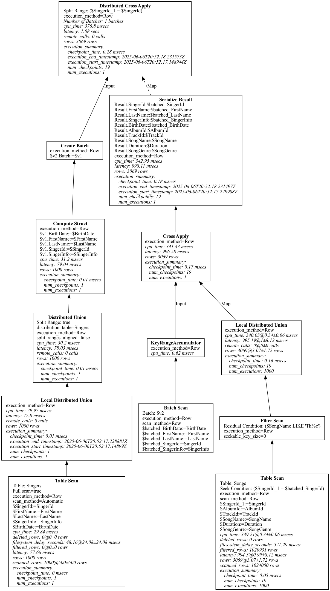

# spannerplanviz

Cloud Spanner Query Plan Visualizer using [goccy/go-graphviz](https://github.com/goccy/go-graphviz).


(Possibly) remote calls are rendered as dashed lines.

## Install

```sh
go install github.com/apstndb/spannerplanviz@latest
```

## Usage

It can read various types in JSON and YAML.

* [QueryPlan](https://cloud.google.com/spanner/docs/reference/rest/v1/ResultSetStats?hl=en#QueryPlan)
    * Can get easily by client libraries
        * [AnalyzeQuery()](https://pkg.go.dev/cloud.google.com/go/spanner#ReadOnlyTransaction.AnalyzeQuery)
        * [RowIterator.QueryPlan](https://pkg.go.dev/cloud.google.com/go/spanner#RowIterator)
* [ResultSetStats](https://cloud.google.com/spanner/docs/reference/rest/v1/ResultSetStats?hl=en)
    * Output of DOWNLOAD JSON in [the official query plan visualizer](https://cloud.google.com/spanner/docs/tune-query-with-visualizer?hl=en)
* [ResultSet](https://cloud.google.com/spanner/docs/reference/rest/v1/ResultSet?hl=en)
    * Output of `gcloud spanner databases execute-sql` and [execspansql](https://github.com/apstndb/execspansql)

### PLAN

```
$ gcloud spanner databases execute-sql --instance=sampleinstance sampledb --query-mode=PLAN --format=yaml \
  --sql="SELECT SongName FROM Songs WHERE STARTS_WITH(SongName, @prefix)" |
  spannerplanviz --full --type=svg --output plan.svg
```

### PROFILE

You see verbose profile information. (Currently, `histograph` is not shown.)

```
$ gcloud spanner databases execute-sql --instance=sampleinstance sampledb --query-mode=PROFILE --format=yaml \
  --sql "SELECT * FROM Singers JOIN Songs USING(SingerId) WHERE SongName LIKE 'Th%e'" |
  spannerplanviz --full --type=svg --output profile.svg
```




## Disclaimer

This tool is Alpha quality.